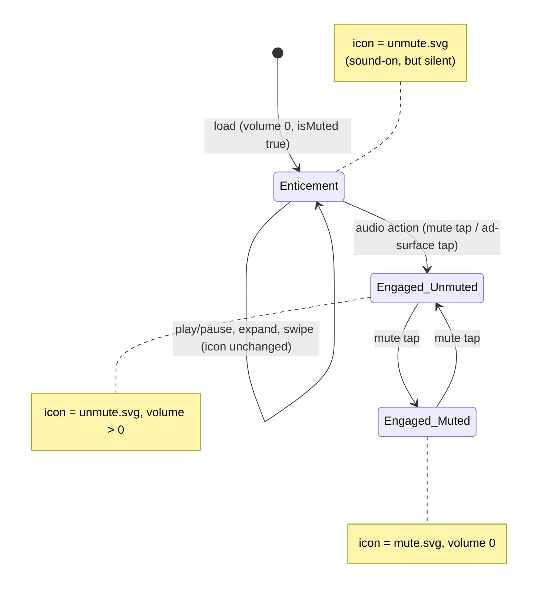

# Contextual-reels control-icon E2E

Playwright end-to-end tests that lock in the play/pause and mute/unmute icon
behavior across content types and slide transitions. They guard the three fixes
shipped in PR #339 (enticement rule, cross-slide persistence, audible-start
mute tap).

## The behavior under test (read this first)

Every scenario orbits one non-obvious rule — the **mute-icon enticement**:

> A unit loads unmuted-but-silent (`volume:0`, so it is genuinely muted). The
> icon nonetheless shows the **sound-on** glyph (`unmute.svg`) to entice a tap.
> The enticement ends **only on an audio action** — a mute-button tap, or an
> ad-surface tap that unmutes — never on play/pause, expand, swipe, or any other
> interaction. Once ended, the icon tracks the **real** mute state forever after,
> and the latch is per-widget-instance, so it survives slide changes.



Icon glyphs: **`unmute.svg`** = sound-on (enticement _or_ real-unmuted);
**`mute.svg`** = real-muted. The tests disambiguate enticement-vs-real by also
checking `<video>.volume` (video slides) or by the next tap's effect (ad slides).

## Coverage matrix

Rows are scenarios, columns are the three feed setups. A cell holds the test ID
that covers it; — = not applicable for that setup (gaps explained below).

| Scenario                                 |                                    A video                                     |           B ad            | C video+ad | Advance via                  |
| ---------------------------------------- | :----------------------------------------------------------------------------: | :-----------------------: | :--------: | ---------------------------- |
| **FP** play/pause never flips mute icon  |                                      FP-1                                      |             —             |   FP-1c    | —                            |
| **MU** mute/unmute cycles real state     |                                      MU-1                                      |           MU-1b           | (in FP-1c) | —                            |
| **XS** engagement persists to next slide |                                     XS-1/2                                     |           XS-1b           |   XS-1c    | swipe (A/C) · completion (B) |
| **OV** ad-surface tap engages audio      |                                       —                                        |           OV-1            |     —      | —                            |
| **EX** fullscreen preserves mute state   |                                       —                                        |             —             |    EX-1    | expand/collapse              |
| **SZ** size variants render + toggle     | SZ-1 (320×50)<br/>SZ-2 (300×250 / 300×600 / 320×480)<br/>SZ-3 (320×480 layout) | SZ-4 (320×480 ad routing) |     —      | —                            |

Gaps, by design: **MU-2** (audible-start, `initialVolume>0`) — no QA tag has
it, covered by the `CompactControlBar` Vitest unit test. **SY-1 / NF-1**
(force a system-mute / no-fill) — impossible against a real always-filling ad.
**AB-1** (mid-roll ad break) — `test.fixme`, the break never reaches the visible
state in the harness. All three are detailed in [ADR 004](../../docs/cxr-decisions/004-e2e-real-genad.md).

## Step-by-step expected outcomes

Each step is `action → asserted state`. `snd` = `unmute.svg`, `mut` = `mute.svg`.

**FP-1 / FP-1c — play/pause never flips the mute icon**

| Step           | mute icon          | play icon    |
| -------------- | ------------------ | ------------ |
| load           | `snd` (enticement) | playing      |
| tap play/pause | `snd` (unchanged)  | toggled      |
| tap play/pause | `snd` (unchanged)  | toggled back |

**MU-1 / MU-1b / (FP-1c tail) — mute cycle toggles the real state**

| Step              | mute icon          | video.volume¹ |
| ----------------- | ------------------ | ------------- |
| load              | `snd` (enticement) | 0             |
| tap mute → unmute | `snd`              | > 0           |
| tap mute → mute   | `mut`              | 0             |
| tap mute → unmute | `snd`              | > 0           |

¹ asserted on video slides (MU-1, FP-1c). On the ad slide (MU-1b) only the icon
is asserted — the ad has no CXR `<video>`.

**XS-1 / XS-1b / XS-1c — engagement persists across the slide change**

| Step                                              | result                                            |
| ------------------------------------------------- | ------------------------------------------------- |
| engage + mute on slide 0 (tap mute ×2)            | `mut`                                             |
| advance (swipe for A/C · ad completion for B)     | active slide index changes                        |
| read next slide                                   | `mut` (real state, **not** a re-shown enticement) |
| tap mute on next slide                            | `snd` (toggle works, not stuck)                   |
| _(XS-2 only)_ tap play/pause on the arrived slide | `mut` unchanged · play toggled                    |

**OV-1 — ad-surface tap engages audio**

| Step                                                  | mute icon          |
| ----------------------------------------------------- | ------------------ |
| load (ad filled)                                      | `snd` (enticement) |
| tap the ad creative surface (not a control) → unmutes | engaged            |
| tap mute → **mutes**                                  | `mut`              |

The tell: after a surface tap the next mute tap _mutes_ (`mut`). Without
engagement, a first tap on the enticement would _unmute_ and stay `snd`.

**EX-1 — fullscreen preserves mute state**

| Step                        | mute icon         | fullscreen |
| --------------------------- | ----------------- | ---------- |
| engage + mute (tap mute ×2) | `mut`             | no         |
| tap expand                  | `mut` (preserved) | yes        |
| tap collapse                | `mut` (preserved) | no         |

**SZ-1 (320×50) / SZ-2 (300×250, 300×600, 320×480) / SZ-3 (320×480) — size variants**

L3 (320×50) uses the compact bar and shows the enticement; L1/L2/L5 use the
default chrome. SZ-1/SZ-2: a visible mute button toggles the icon to a different
state.

SZ-3 asserts the 320×480 (L5) **layout resolution** instead — the slot box, the
injected `meta[name="ad.size"]`, and that the full-player node is present while
the compact bar is absent. SZ-4 covers the same size on the **ad** path: an
ads-only tag must reach `AdLayout` + a real `gen-ad-slot-*`, with no compact bar
and no page errors.

Both read the mounted DOM and never play or tap, so they isolate "did the new
size register" from anything the media/ad network does — the waterfall's outcome
is the ad server's business, the routing is ours.

## How it runs

`playwright.config.ts` builds nothing — it serves the existing `dist/` library
bundle with `serve dist -l 3011`. **Run `npm run build` first** so `dist/`
reflects current source. The build also bakes the GenAd SDK base URL from
`.env.development` (`VITE_CXR_GEN_AD_BASE_URL`), so the real SDK loads from the
right CDN.

```
npm run build
npm run test:e2e            # or: npx playwright test
```

Chromium launches with `--autoplay-policy=no-user-gesture-required` so playback
state is driven by our taps, not Chrome's media-engagement heuristic.

## What's real vs. mocked

Only the **feed API is mocked**; everything else runs end-to-end. The rationale
and tradeoffs are in [ADR 004](../../docs/cxr-decisions/004-e2e-real-genad.md).

| Layer                                                | Status                                                          |
| ---------------------------------------------------- | --------------------------------------------------------------- |
| Tag config + feed (`/goservices/ad_creative[/feed]`) | **Mocked** — verbatim QA responses from `fixtures/raw/`         |
| `ip_info`                                            | Mocked (a fixed US record)                                      |
| GenAd SDK + ad waterfall                             | **Real** — loads from the CDN, fills against the live ad server |
| Content video (Bunny CDN `.m3u8`)                    | **Real** — plays for genuine playback state                     |

Because the ad fills for real, an ad slot's control bar appears on a genuine
fill (tests `waitForAdBar()`), and an ad feed advances when the real ad
**completes** (~15–30s; tests `waitForAdvance()`). A genuine no-fill is treated
as a real failure — the QA ad config is expected to fill.

## How the harness works (`support/`)

- **`mountWidget.ts`** — serves a tiny harness page hosting one `.gen-ext`,
  loads the built loader, and intercepts the feed API with the captured QA
  responses. Leaves the GenAd SDK + media to load for real.
- **`CompactBar.page.ts`** — shadow-DOM-piercing page object. Reads the active
  slide's icon by asset filename (`unmute.svg` = sound-on, `mute.svg` = muted)
  and corroborates with `<video>.volume`. Taps are real pointer clicks.
  `muteIconAnywhere()` / `tapMuteAnywhere()` work across every chrome (compact
  bar, default top bar, fullscreen rail). `waitForAdBar()` waits for a real
  fill; `waitForAdvance()` waits for the real completion-driven advance.

## Fixtures

`fixtures/raw/<tagId>.{tag,feed}.json` are verbatim QA responses. The `TAG` map
in `mountWidget.ts` names them by variation:

| Variation     | Reels                     | Path exercised          |
| ------------- | ------------------------- | ----------------------- |
| `adOnly`      | `type:"ads"` + `video_ad` | AdLayout / AdControlBar |
| `videoPlusAd` | `loop` + ad_config        | VideoLayout + ad break  |
| `videoOnly`   | `loop`                    | plain VideoLayout       |

To refresh a fixture: `curl -H "x-user-id: e2e" "https://api.qa.begenuin.com/goservices/ad_creative?tag_id=<id>"`
(and `…/ad_creative/feed?tag_id=<id>`), saving to the `.tag.json` / `.feed.json`
files.

## Where each scenario lives

The full matrix + expected outcomes are above. This is just the file map:

| Spec file                        | Scenarios                          |
| -------------------------------- | ---------------------------------- |
| `controls.video-only.spec.ts`    | FP-1, MU-1, XS-1, XS-2             |
| `controls.audio-ad.spec.ts`      | MU-1b, OV-1, XS-1b                 |
| `controls.video-plus-ad.spec.ts` | FP-1c, XS-1c, EX-1, AB-1 (`fixme`) |
| `controls.sizes.spec.ts`         | SZ-1, SZ-2, SZ-3, SZ-4             |
| `init.spec.ts`                   | bundle smoke (pre-existing)        |
