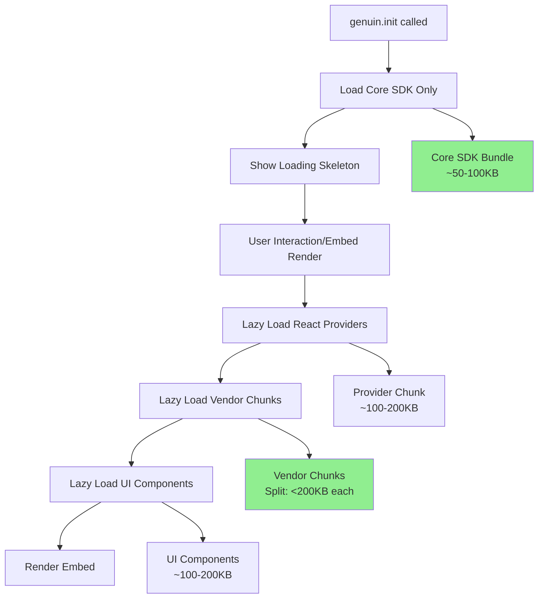

# SDK Lazy Lo

ading Optimization Plan

## Problem Statement

Currently, when `genuin.init()` is called, the SDK eagerly loads all dependencies including:

- All React providers (AuthProvider, BaseContextProvider, EmbedProvider, etc.)
- Vendor chunks (react-query, radix, animation libraries, forms, utils, router)
- UI components (Toaster, Loader, Skeleton, FeedSkeleton)
- Utility functions from @genuin/components and @genuin/ui

This causes significant page bloat on initialization. The goal is to lazy load these dependencies only when an embed is actually rendered, similar to how `LazyEmbed` and `LazyStandardWall` are already lazy loaded in `react-utils.tsx`.

## Architecture Overview



**Note**: Chunk size optimization (Phase 4) works in parallel with lazy loading. By splitting large chunks into smaller ones (<200KB), we improve:

- Parallel loading of multiple small chunks
- Better caching (smaller chunks change less frequently)
- Faster initial render (can start rendering with first chunk)

## Phase 1: Metrics Infrastructure & Baseline

**Goal**: Establish measurement infrastructure and capture baseline metrics

### Tasks:

1. **Create metrics collection utility** (`packages/web-sdk/src/utils/metrics.ts`)

- Track bundle sizes (initial load, total transferred)
- Count chunks loaded at each stage
- Measure time to interactive (TTI)
- Log chunk loading timeline

2. **Add performance markers** in:

- `packages/web-sdk/src/loader.js` - SDK load start/end
- `packages/web-sdk/src/sdk/genuin-sdk.ts` - init start/end
- `packages/web-sdk/src/sdk/react-utils.tsx` - embed render start/end

3. **Create baseline measurement script** (`packages/web-sdk/scripts/measure-baseline.ts`)

- Build production bundle
- Analyze chunk sizes and dependencies
- Generate baseline report
- Use `rollup-plugin-visualizer` or similar to visualize chunk composition

4. **Document baseline metrics** in `packages/web-sdk/PERFORMANCE_BASELINE.md`

- Initial bundle size (gen_sdk.min.js + genuin-sdk-[hash].js)
- All vendor chunks loaded on init
- Total bytes transferred
- Chunk loading timeline

**Files to modify:**

- `packages/web-sdk/src/utils/metrics.ts` (new)
- `packages/web-sdk/src/loader.js`
- `packages/web-sdk/src/sdk/genuin-sdk.ts`
- `packages/web-sdk/src/sdk/react-utils.tsx`
- `packages/web-sdk/scripts/measure-baseline.ts` (new)

## Phase 2: Lazy Load React Providers

**Goal**: Defer loading of React providers until embed render

### Current Issue:

In `packages/web-sdk/src/sdk/react-utils.tsx`, providers are eagerly imported:

```typescript
import { AuthProvider } from '@genuin/components/context/auth'
import { BaseContextProvider } from '@genuin/components/context/base'
import { EmbedProvider } from '@genuin/components/context/embed'
// ... etc
```


### Solution:

1. **Convert provider imports to dynamic imports** in `loadNewEmbed()`:

- Create a `loadProviders()` function that dynamically imports all providers
- Wrap provider loading in a Promise that resolves before rendering
- Update `EmbedSkeleton` to work without React providers (use plain HTML/CSS)

2. **Update `loadLoadingView()`** to use non-React skeleton:

- Create `loadLoadingViewHTML()` that uses plain HTML/CSS
- Only create React root when actually rendering embed

3. **Lazy load React Query Provider**:

- Move `ReactQueryClientProvider` import to dynamic import
- Only load when embed is rendered

**Files to modify:**

- `packages/web-sdk/src/sdk/react-utils.tsx`
- `packages/web-sdk/src/sdk/genuin-sdk.ts` (update `loadLoadingView` call)

**Expected Impact:**

- Defer ~100-200KB of provider code
- Defer react-query vendor chunk (~50-100KB)

## Phase 3: Lazy Load UI Components

**Goal**: Defer loading of UI components until needed

### Current Issue:

UI components are eagerly imported:

```typescript
import { Loader } from '@genuin/ui/components/loader'
import { Toaster } from '@genuin/ui'
import { Skeleton } from '@genuin/ui/components/skeleton'
import { FeedSkeleton } from '@genuin/components/templates/feed'
```


### Solution:

1. **Lazy load UI components**:

- Convert `Loader`, `Skeleton`, `FeedSkeleton` to dynamic imports
- Only load `Toaster` when embed is rendered (not in skeleton)

2. **Create lightweight HTML skeletons**:

- Replace React-based `EmbedSkeleton` with HTML/CSS version for initial load
- Keep React skeleton for Suspense fallback (loaded later)

3. **Lazy load utility functions**:

- Convert `getBrandType`, `cn`, `useDeviceDetectMediaQuery` to dynamic imports
- Only load when needed for embed rendering

**Files to modify:**

- `packages/web-sdk/src/sdk/react-utils.tsx`
- `packages/web-sdk/src/utils/skeleton-html.ts` (new - HTML skeleton generator)

**Expected Impact:**

- Defer ~100-200KB of UI component code
- Defer vendor-radix chunk (~100-200KB)

## Phase 4: Chunk Size Optimization

**Goal**: Optimize chunk splitting strategy following best practices to balance chunk sizes, minimize HTTP requests, and avoid browser request queuing

### Current Build Analysis (Actual Sizes from Local Build):

From local build analysis:

- `index-xR0MtfRD.js`: **1.0MB uncompressed** - CRITICAL: Way too large, pulling in everything
- `feed-y8VKmFvg.js`: **914KB uncompressed** - Very large, should be split
- `vendor-forms-CkEzjeKK.js`: **684KB uncompressed** - Very large, should be split
- `vendor-animation-DYXKWvZj.js`: **492KB uncompressed** - Large, consider splitting
- `vendor-external-Bzsi_xsz.js`: **255KB uncompressed** - Acceptable but could be optimized
- `vendor-utils-VGgNV1X-.js`: **208KB uncompressed** - Good size
- `vendor-react-query-xjpNQsWM.js`: **175KB uncompressed** - Good size
- `vendor-radix-BXbLIVho.js`: **189KB uncompressed** - Good size
- `embed-ByOHBC1s.js`: **97KB uncompressed** - Good size
- `vendor-router-CVpFdVJ6.js`: **6.7KB uncompressed** - Too small, consider merging

### Chunk Sizing Best Practices:

**Optimal Chunk Size Guidelines:**

- **Target size**: 100-400KB uncompressed (50-200KB compressed/gzipped)
- **Minimum size**: 20KB (avoid too many tiny chunks - HTTP overhead)
- **Maximum size**: 500KB uncompressed (larger chunks block parallel loading)
- **Ideal range**: 150-300KB uncompressed per chunk

**Browser Request Limits:**

- **HTTP/1.1**: 6 concurrent connections per domain (legacy, but still relevant)
- **HTTP/2**: 100+ concurrent streams per connection (modern standard)
- **HTTP/3**: Similar to HTTP/2 with better multiplexing
- **Optimal chunk count**: 5-15 chunks for balanced loading
- **Too many chunks** (>20): Adds HTTP overhead, potential queuing
- **Too few chunks** (<5): Reduces parallel loading benefits

**Strategy:**

1. Keep critical chunks between 100-300KB
2. Split chunks >400KB into smaller pieces
3. Merge chunks <20KB with related chunks
4. Prioritize parallel loading over minimizing request count
5. Use HTTP/2 multiplexing effectively (most modern browsers)

### Root Cause Analysis:

1. **Index chunk bloat (1.0MB)**: `src/index.ts` imports styles and exports everything, causing cascade of imports
2. **Poor chunk splitting**: Large vendor chunks not split optimally
3. **Forms vendor chunk (684KB)**: Includes entire form library (react-hook-form, zod, input-otp, etc.) in one chunk
4. **Feed chunk (914KB)**: Includes entire feed template with all dependencies
5. **No size-based splitting**: Vite config doesn't enforce chunk size limits

### Solution:

1. **Optimize index.ts to reduce initial chunk size**:

- Remove or lazy load CSS import (`import './styles.css'`)
- Use selective exports instead of `export *`
- Split index into core exports vs. full SDK exports
- Create separate entry points for different use cases
- **Target**: Reduce from 1.0MB to <200KB

2. **Break up large vendor chunks** in `vite.config.mjs` with size-aware splitting:

- **vendor-forms (684KB → 3 chunks ~200KB each)**:
    - `vendor-forms-core` (react-hook-form core ~150KB)
    - `vendor-forms-validation` (zod ~100KB)
    - `vendor-forms-inputs` (input-otp, react-phone-number-input ~150KB)
- **vendor-animation (492KB → 2-3 chunks ~150-200KB each)**:
    - `vendor-animation-motion` (motion library ~200KB)
    - `vendor-animation-carousel` (swiper, embla-carousel ~200KB)
    - `vendor-animation-player` (openplayerjs ~100KB, merge with carousel if <150KB)
- **vendor-external (255KB → keep as-is or split if needed)**:
    - Keep as single chunk if <300KB, or split into analytics vs. other

3. **Optimize feed chunk (914KB → 3-4 chunks ~200-300KB each)**:

- Split feed into logical parts:
    - `feed-core` (~250KB - main feed logic)
    - `feed-comments` (~200KB - comment system)
    - `feed-interactions` (~200KB - likes, shares, follows)
    - `feed-media` (~250KB - video/audio players if not in vendor-animation)
- Use dynamic imports for feed sub-components

4. **Merge tiny chunks**:

- `vendor-router` (6.7KB) → Merge with `vendor-utils` or `embed` chunk
- Avoid chunks <20KB unless they're truly independent

5. **Implement size-based chunk splitting** in `vite.config.mjs`:

- Add function to calculate chunk size and split if >400KB
- Use Rollup's `maxParallelFileOps` and chunk size limits
- Set `chunkSizeWarningLimit` to 300KB (currently 1000KB)
- Add build-time analysis and warnings

6. **Add chunk analysis tool**:

- Create `packages/web-sdk/scripts/analyze-chunks.ts`
- Analyze chunk sizes, dependencies, and loading order
- Generate report with recommendations
- Integrate into CI/CD to prevent regressions

**Files to modify:**

- `packages/web-sdk/src/index.ts` (optimize exports and CSS loading)
- `packages/web-sdk/vite.config.mjs` (improve chunk splitting with size limits)
- `packages/web-sdk/scripts/analyze-chunks.ts` (new - chunk size analyzer)
- `packages/web-sdk/scripts/validate-chunk-sizes.ts` (new - CI validation)

**Expected Impact:**

- Reduce `index` chunk from 1.0MB to <200KB uncompressed (80% reduction)
- Break `vendor-forms` from 684KB to 3 chunks ~200KB each
- Break `feed` chunk from 914KB to 3-4 chunks ~200-300KB each
- Reduce `vendor-animation` from 492KB to 2-3 chunks ~150-200KB each
- Merge `vendor-router` (6.7KB) with related chunk
- **Total chunks**: 10-15 chunks (optimal range)
- **Largest chunk**: <300KB uncompressed
- **Average chunk size**: ~150-250KB uncompressed
- **Overall**: Better parallel loading, faster initial render, optimal browser utilization

## Phase 5: Optimize Vendor Chunk Loading

**Goal**: Ensure vendor chunks are only loaded when their dependencies are needed

### Current Issue:

Vite config creates vendor chunks, but they're still eagerly loaded because providers/components import them.

### Solution:

1. **Review and optimize `vite.config.mjs` manual chunks**:

- Ensure vendor chunks are only created for code that's actually used
- Add chunk loading priority hints
- Consider splitting large vendor chunks further (covered in Phase 4)

2. **Defer analytics loading**:

- Move RudderStack initialization to lazy load
- Only load analytics when embed is rendered

3. **Optimize React/React-DOM loading**:

- Keep React/React-DOM in main bundle (as per current config) for proper module resolution
- Ensure they're not duplicated across chunks

**Files to modify:**

- `packages/web-sdk/vite.config.mjs` (chunk optimization)
- `packages/web-sdk/src/views/loader.tsx` (RudderStack lazy loading)

**Expected Impact:**

- Vendor chunks only load when needed
- Reduce initial bundle by ~500KB-1MB

## Phase 6: Core SDK Optimization

**Goal**: Minimize core SDK bundle size

### Tasks:

1. **Review core SDK imports**:

- Ensure only essential code is in core bundle
- Move non-critical utilities to lazy-loaded modules

2. **Optimize styles loading**:

- Consider lazy loading CSS or splitting critical CSS
- Ensure CSS doesn't block initialization

3. **Tree-shaking verification**:

- Verify unused code is eliminated
- Check for unnecessary re-exports

**Files to modify:**

- `packages/web-sdk/src/index.ts`
- `packages/web-sdk/src/core/index.ts`
- `packages/web-sdk/src/sdk/genuin-sdk.ts`

**Expected Impact:**

- Reduce core bundle by ~20-30%

## Phase 7: Measurement & Validation

**Goal**: Measure improvements and validate functionality

### Tasks:

1. **Run post-optimization measurements**:

- Compare against baseline metrics
- Generate improvement report

2. **Functional testing**:

- Verify all SDK features work correctly
- Test lazy loading edge cases
- Verify error handling

3. **Performance testing**:

- Test on slow networks (3G simulation)
- Test with multiple embeds
- Test expand/collapse functionality

4. **Document improvements** in `packages/web-sdk/PERFORMANCE_IMPROVEMENTS.md`:

- Before/after metrics comparison
- Chunk loading timeline comparison
- User-facing improvements

**Files to create/modify:**

- `packages/web-sdk/PERFORMANCE_IMPROVEMENTS.md` (new)
- `packages/web-sdk/scripts/measure-performance.ts` (new)

## Implementation Strategy

### Critical Path (What loads on init):

- Core SDK initialization logic
- Event system
- HTML/CSS loading skeleton (no React)
- Basic error handling

### Deferred Loading (What loads when embed renders):

- React providers (AuthProvider, BaseContextProvider, etc.)
- React Query Provider
- UI components (Loader, Skeleton, Toaster)
- Vendor chunks (react-query, radix, animation, forms, utils, router) - **split into smaller chunks**
- Analytics (RudderStack)
- Embed/StandardWall components (already lazy loaded)

### Chunk Size Optimization Strategy:

**Phase 4 (Chunk Size Optimization) can be worked on in parallel with Phases 2-3** because:

1. It focuses on build-time optimization (vite.config.mjs)
2. Lazy loading (Phases 2-3) focuses on runtime optimization (dynamic imports)
3. Both complement each other: smaller chunks + lazy loading = optimal performance

**Recommended approach**:

- Start with Phase 1 (metrics) to establish baseline
- Work on Phase 4 (chunk size) in parallel with Phase 2 (lazy load providers)
- Phase 4 improvements will make Phase 2-3 lazy loading more effective

## Success Criteria

1. **Initial bundle size**: < 150KB (core SDK + loader)
2. **Chunks on init**: Only core SDK chunk + loader
3. **Total bytes on init**: < 200KB
4. **Vendor chunks**: Load only when embed is rendered
5. **Time to interactive**: < 100ms for SDK initialization
6. **Functional parity**: All features work as before
7. **Chunk size optimization**:

- **Largest chunk**: < 300KB uncompressed
- **Average chunk size**: 150-250KB uncompressed
- **Total chunk count**: 10-15 chunks (optimal range)
- **No chunks < 20KB** (merged with related chunks)
- **No chunks > 500KB** (split into smaller chunks)
- **Index chunk**: < 200KB uncompressed (from current 1.0MB)

## Risk Mitigation

1. **React Context timing**: Ensure React providers load before components that need them
2. **Error boundaries**: Maintain error handling during lazy loading
3. **Backward compatibility**: Ensure existing integrations continue to work
4. **Loading states**: Provide smooth loading experience during lazy loading

## Metrics to Track

### Before Metrics:

- Initial bundle size (KB)
- Number of chunks loaded on init
- Total bytes transferred on init
- Time to interactive (ms)
- Chunk loading timeline
- **Individual chunk sizes** (compressed/uncompressed):
- index chunk: ~310KB / ~1MB
- vendor-forms: ~164KB / ~701KB
- feed chunk: ~222KB / ~936KB
- vendor-animation: ~139KB / ~504KB
- Largest chunk size
- Average chunk size

### After Metrics:

- Same metrics for comparison
- Lazy loading success rate
- Time to embed render
- **Chunk size improvements**:
- index chunk: Target < 200KB uncompressed
- vendor-forms: Target < 200KB per chunk (split)

## Progress To Date

- Baseline measurement: ran `npm run measure:baseline` and generated `packages/web-sdk/PERFORMANCE_BASELINE.md`. Baseline highlights: total ~5.29MB, 37 chunks, largest chunk `index-HJqWj5-y.js` ≈ 0.96MB; multiple index/app and vendor chunks are requested during `genuin.init()`.

- Validation: ran `npm run validate:chunks`. Validator exited non-zero; failing/oversized chunks include `index-HJqWj5-y.js` (981.19KB), `index-BRA4cOEx.js` (605.72KB), `standard-wall-BBTFSZuT.js` (919.76KB), and `vendor-forms-inputs-9qAuk8d8.js` (579.68KB). Warnings reported many very small chunks (<20KB) and total bundle size >5MB.

- Chunk analysis: ran `npm run analyze:chunks` and generated `packages/web-sdk/CHUNK_ANALYSIS.md` with per-chunk recommendations (split large app/vendor chunks; merge tiny utility chunks).

- Runtime verification: confirmed production preview loads `gen_sdk.js` + `genuin-sdk` and immediately requests many `/dist/chunks/*` files on `genuin.init()` (eager embed initialization is causing early dynamic import execution).

- Files/scripts added or updated during this effort:
    - `packages/web-sdk/scripts/measure-baseline.ts` (new)
    - `packages/web-sdk/scripts/analyze-chunks.ts` (new)
    - `packages/web-sdk/scripts/validate-chunk-sizes.ts` (new)
    - `packages/web-sdk/PERFORMANCE_BASELINE.md` (generated)
    - `packages/web-sdk/CHUNK_ANALYSIS.md` (generated)
    - `packages/web-sdk/vite.config.mjs` (manual chunking/tuning)
    - `packages/web-sdk/src/index.ts` (selective exports, lazy CSS import)
    - `packages/web-sdk/src/sdk/react-utils.tsx` (dynamic provider imports)
    - small performance markers added to `packages/web-sdk/src/loader.js` and SDK entry files
    - commit: `a24f4043` contains the main lazy-loading and build config changes

- Immediate next actions (recommended):
    1. Run a bundle visualizer on a production build to get module-level breakdown of the large `index`/`feed`/`standard-wall` chunks.
    2. Implement runtime deferral so `initializeAllEmbeds()` does not eagerly render embeds on `genuin.init()` (use IntersectionObserver or explicit render), then move provider/UI imports behind that path.
    3. Split `vendor-forms-inputs` and other oversized vendor chunks into smaller manual chunks in `vite.config.mjs`, re-run `analyze:chunks` and `validate:chunks`.

All generated reports and scripts live under `packages/web-sdk/`.